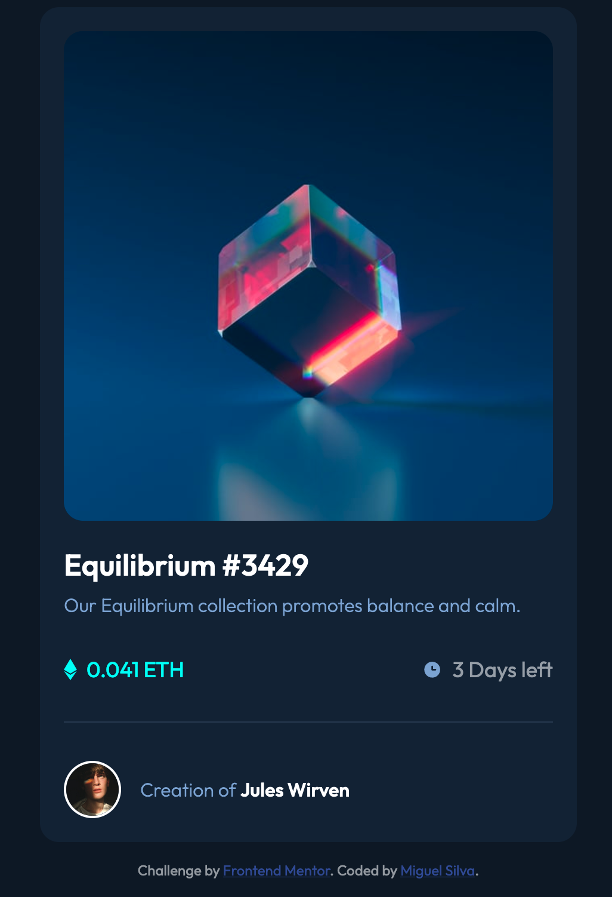
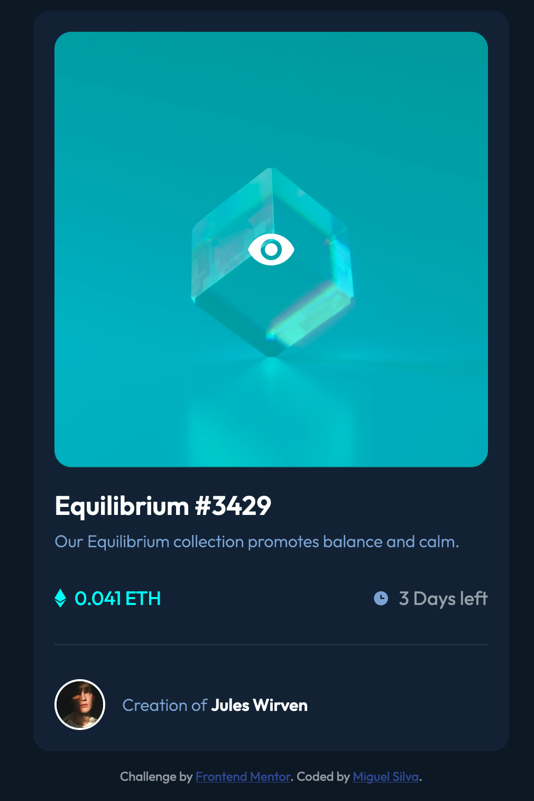

# Sign form with active state.

## Normal state:


## Active state:



CSS pratice.

Design and requests provided by: https://www.frontendmentor.io/ 

## Installation


```bash
Open index.html in your browser.
```

Feel free to use it. 